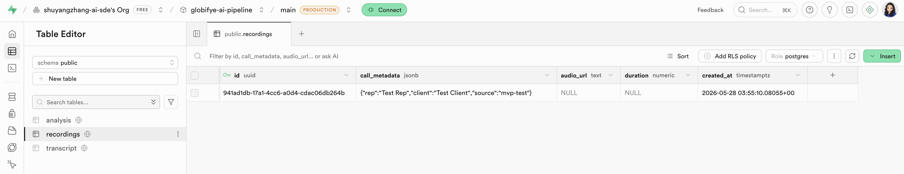
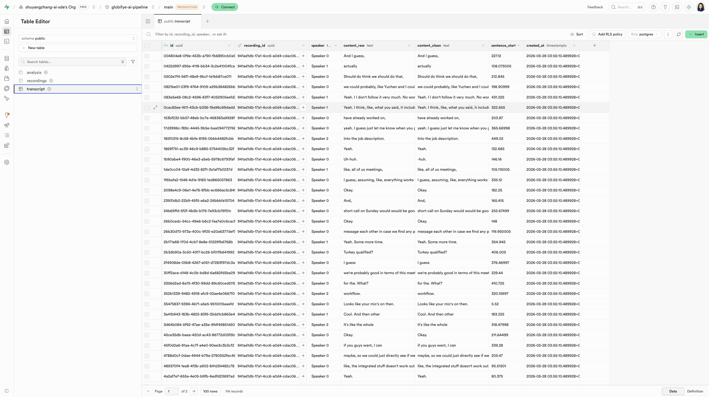

# Step 5 — Phase 1: Transcript Parsing & DB Write

*Part of [AI Pipeline MVP Outline](ai-pipeline-mvp-outline.md)*

---

This step takes the utterances saved by Step 4 and writes them to the Supabase `transcript` table. **You do not need to call the Deepgram API again** — the JSON file saved in Step 4 (`sample-transcripts/sample-audio-1.json`) is the input for this entire step.

Two versions of the text are produced per DB row: `content_raw` (filler words kept, sent to LLM in Step 7) and `content_clean` (filler words stripped, displayed in the UI in Step 9).

---

## What you will do in this step

**5.2** — Understand the data transformation (what changes on the way to the DB)
**5.3** — Add `stripFillerWords()` to `lib/deepgram.ts`
**5.4** — Add `createRecording()` and `writeTranscript()` to `lib/supabase.ts`
**5.5** — Create and run `scripts/test-transcript.ts` (reads JSON → writes to DB)
**5.6** — Verify the rows in Supabase
**5.7** — Common errors and fixes

---

#### 5.2 Understand the data transformation

Each JSON utterance becomes one row in the `transcript` table. Here is what changes:

```
JSON utterance                            transcript row
──────────────────────────────────────    ──────────────────────────────────────────────────────
speaker:    0                        →    speaker:            "Speaker 0"
transcript: "Yeah um I think the         content_raw:        "Yeah um I think the price is a bit high"
             price is a bit high"    →    content_clean:      "Yeah I think the price is a bit high"
start:      45.2                     →    sentence_start_sec: 45.2
```

Two transformations happen:

1. **Speaker label formatting** — The JSON has `speaker: 0` (integer). The DB stores `"Speaker 0"` (string) for readability.

2. **Filler word stripping** — `content_raw` is kept exactly as Deepgram returned it (filler words intact). `content_clean` has `um`, `uh`, `like`, `you know`, and similar words removed.
   - The LLM receives `content_raw` — filler words signal hesitation and are useful for objection detection.
   - The UI displays `content_clean` — easier to read.

---

#### 5.3 Add filler word stripping to `lib/deepgram.ts`

**Why regex, and what are its limits?**

The current pattern handles the **predictable** fillers well: `um`, `uh`, `hmm`, and their elongated variants (`umm`, `uhh`). These are safe to remove by pattern because they are almost never meaningful.

The problem is the **context-dependent** ones:

| Word | Filler use | Meaningful use |
|---|---|---|
| `like` | "it's like, really expensive" | "I like this product" |
| `basically` | "so basically, yeah" | "it basically works the same way" |
| `right` | "right, right, right" | "that's the right approach" |
| `actually` | "actually, um, so..." | "that actually saves us time" |
| `I mean` | filler transition | genuinely clarifying a point |

Regex can't distinguish these — it would either over-remove (breaking meaning) or under-remove (leaving fillers in).

**Why not use an LLM to strip fillers instead?**

Using an LLM would genuinely solve the context problem, but there is a pipeline timing issue: `content_clean` is written to the DB in Step 5, before the LLM runs in Step 7. Calling an LLM per utterance at Step 5 would mean one extra LLM call per utterance (a 30-minute call could have 200+ utterances), added latency before any transcript rows are saved, and extra cost on every transcription.

**There is a path that avoids this tradeoff.** The Step 6 LLM prompt already includes a "Step 0 — second-pass correction" that fixes homophones, jargon, and company names across the full transcript. The corrected text from that pass could be written back as `content_clean` — one LLM call, full context, no per-utterance overhead. The tradeoff: `content_clean` would not exist until after the post-call analysis button is clicked, so the UI would fall back to the regex-cleaned version during a live call.

**Decision for now:** Keep the regex for the MVP. The common fillers (`um`, `uh`, `hmm`) cover most of what appears in a controlled sample audio, and `content_clean` is only for UI display — it does not need to be perfect. The LLM correction path is the production upgrade.

---

Open `lib/deepgram.ts`. At the bottom of the file, **after** the `transcribeFile` function, add:

```typescript
// ---------------------------------------------------------------------------
// Filler word stripping
// ---------------------------------------------------------------------------

// Matches filler words as whole words only, including any trailing comma and space.
// content_raw keeps these intact (sent to LLM — signals hesitation).
// content_clean strips them (displayed in UI).
// Note: only predictable, unambiguous fillers are listed here (um, uh, hmm).
// Context-dependent words (like, basically, right, actually) are intentionally
// excluded — regex cannot distinguish filler use from meaningful use.
// Production upgrade: let the Step 7 LLM correction pass own content_clean instead.
const FILLER_PATTERN = /\b(um+|uh+|hmm+|mhm|uh-huh|like|you know)\b[,]?\s*/gi

export function stripFillerWords(text: string): string {
  return text
    .replace(FILLER_PATTERN, '')
    .replace(/\s{2,}/g, ' ')   // collapse any double spaces left behind
    .trim()
}
```

Save the file.

---

#### 5.4 Add DB write helpers to `lib/supabase.ts`

Open `lib/supabase.ts`. After the existing Supabase client setup, add the following two functions.

**First**, add the import at the top of the file (with the other imports):

```typescript
import { DeepgramUtterance, stripFillerWords } from './deepgram'
```

**Then**, add these two functions at the bottom:

```typescript
// ---------------------------------------------------------------------------
// Recording helpers
// ---------------------------------------------------------------------------

/**
 * Creates a new row in the recordings table and returns its UUID.
 * Must be called before writeTranscript — transcript rows have a FK to recordings.
 */
export async function createRecording(
  metadata: Record<string, unknown> = {}
): Promise<string> {
  const { data, error } = await supabaseAdmin
    .from('recordings')
    .insert({ call_metadata: metadata })
    .select('id')
    .single()

  if (error) throw new Error(`Failed to create recording row: ${error.message}`)
  return data.id
}

// ---------------------------------------------------------------------------
// Transcript helpers
// ---------------------------------------------------------------------------

/**
 * Batch-inserts all utterances as transcript rows for a given recording.
 * Produces content_raw (filler words kept) and content_clean (filler words stripped).
 */
export async function writeTranscript(
  recordingId: string,
  utterances: DeepgramUtterance[]
): Promise<void> {
  const rows = utterances.map(u => ({
    recording_id:       recordingId,
    speaker:            `Speaker ${u.speaker}`,         // "Speaker 0", "Speaker 1"
    content_raw:        u.transcript,                   // filler words intact — sent to LLM
    content_clean:      stripFillerWords(u.transcript), // filler words stripped — shown in UI
    sentence_start_sec: u.start,
  }))

  const { error } = await supabaseAdmin
    .from('transcript')
    .insert(rows)

  if (error) throw new Error(`Transcript write failed: ${error.message}`)
}
```

Save the file.

> **Why `createRecording` must come first:** 
> The `transcript` table has a foreign key (`recording_id`) pointing to the `recordings` table. If you try to insert transcript rows before the recording row exists, Supabase will reject the insert with a foreign key constraint error.

---

#### 5.5 Create and run the test script

**Step 1 — Create** `scripts/test-transcript.ts`
**Step 2 — Run it** ```npx tsx --env-file=.env.local scripts/test-transcript.ts```

> **Why `--env-file` and not `dotenv.config()`?** 
> `lib/supabase.ts` creates the Supabase client at module load time. With `tsx`, ES module imports are hoisted — so Supabase initializes before `dotenv.config()` runs and sees an empty `NEXT_PUBLIC_SUPABASE_URL`. Passing `--env-file` loads the variables before any module initializes, which fixes the timing issue.

**Step 3 — Check the output**

Expected output:

```
📂 Loading utterances from saved JSON...
✅ Loaded 24 utterances from ./sample-transcripts/sample-audio-1.json

Filler stripping preview (first 3 utterances):
  raw:   Hi, thanks for calling GlobiFYE. How can I help you today?
  clean: Hi, thanks for calling GlobiFYE. How can I help you today?

  raw:   Yeah, um, I was looking at your pricing page and I had a few questions.
  clean: Yeah, I was looking at your pricing page and I had a few questions.

  raw:   Of course, happy to walk you through it.
  clean: Of course, happy to walk you through it.

📝 Creating recording row...
✅ Recording row created: a1b2c3d4-e5f6-...

💾 Writing transcript rows to Supabase...
✅ 24 transcript rows written

💾 recording_id saved → ./sample-transcripts/recording-ids.json
📋 recording_id for Steps 7+: a1b2c3d4-e5f6-...
```

> In the filler stripping preview, lines with `um`, `uh`, or `hmm` should show them removed in the `clean` version. If `raw` and `clean` are identical for every line, `stripFillerWords` is not being applied — check that the import in `lib/supabase.ts` is correct.

---

#### 5.6 Verify in Supabase

**Check the `recordings` table:**

1. Open your Supabase project → **Table Editor** → select `recordings`
2. You should see a new row at the top
3. Click on it and confirm the `call_metadata` column contains `{ "rep": "Test Rep", "client": "Test Client", "source": "mvp-test" }`



**Check the `transcript` table:**

1. Go to **Table Editor** → select `transcript`
2. In the filter bar, filter `recording_id` = the UUID printed in the terminal
3. You should see N rows (matching the utterance count from the terminal output)
4. Click into a few rows and check each column:

| Column | What to check |
|---|---|
| `speaker` | Values are `"Speaker 0"` or `"Speaker 1"` — string, not integer |
| `content_raw` | Contains filler words (`um`, `uh`, etc.) exactly as Deepgram returned |
| `content_clean` | Same text with filler words removed — should read more naturally |
| `sentence_start_sec` | Numbers that increase from row to row, matching the audio timeline |



---

#### 5.7 Common errors and fixes

| Error | Likely cause | Fix |
|---|---|---|
| `ENOENT: no such file or directory, open './sample-transcripts/sample-audio-1.json'` | Step 4 test script was not run, or file is in a different path | Run `scripts/test-deepgram.ts` first; confirm the file exists at `sample-transcripts/sample-audio-1.json` |
| `Transcript write failed: violates foreign key constraint` | `writeTranscript` called before `createRecording` | Always call `createRecording` first and pass the returned `id` to `writeTranscript` |
| `supabaseUrl is required` | `.env.local` loaded after Supabase client initializes | Use `npx tsx --env-file=.env.local` instead of plain `npx tsx` |
| `Failed to create recording row: ...` | Supabase keys missing or wrong | Check `SUPABASE_SERVICE_ROLE_KEY` and `NEXT_PUBLIC_SUPABASE_URL` in `.env.local` |
| `content_clean` is identical to `content_raw` | Filler words in audio don't match the regex | The `FILLER_PATTERN` uses the `i` flag — check if words like `"Like"` or `"Um"` appear at the sentence start |
| `speaker` column shows `"Speaker undefined"` | `diarize: true` was not set in Step 4 | Check `lib/deepgram.ts` — confirm `diarize: true` is in the options |
| `Cannot find module './deepgram'` in `supabase.ts` | Import path wrong | Use `'./deepgram'` — both files are in the same `lib/` folder |
| `sentence_start_sec` is `0` for all rows | Timestamps missing from utterance data | Confirm `utterances: true` is set in `transcribeFile` in `lib/deepgram.ts` |

---

> ✅ If the `transcript` table has rows with distinct speakers, `content_raw` containing filler words, and `content_clean` without them, **Step 5 is complete.** 

→ Next: [Step 6 — LLM Analysis Prompt](ai-pipeline-mvp-outline.md#step-6--phase-2-llm-analysis-prompt).
