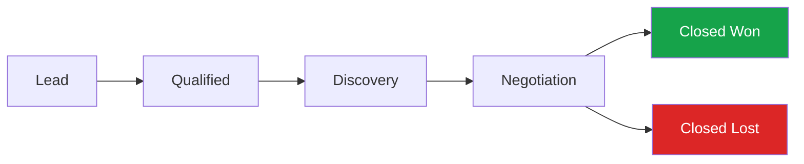

# Sample Sales Call Scripts — TTS Testing

## Purpose

These scripts are for testing the **Step 10 live transcription pipeline** (Deepgram Nova-3 WebSocket). They are designed to be fed into a Text-to-Speech model to generate realistic `.wav` / `.mp3` audio files for local development and demo use.

Two scenarios are provided:
1. **Script 1 — The Winning Call**: client agrees to move forward; packed with strong rep moments.
2. **Script 2 — The Lost Deal**: client declines; packed with realistic objections.

---

## Generation Workflow

```
┌─────────────────────────────────────────────┐
│  audio-script/script-1-winning-call.md      │
│  audio-script/script-2-lost-deal.md         │
│  (dialogue lines + speaker labels)          │
└─────────────────┬───────────────────────────┘
                  │  hardcoded into SCRIPT_1 / SCRIPT_2 arrays
                  ▼
┌─────────────────────────────────────────────┐
│  generate_sample_calls_ffmpeg.py            │
│  · edge-tts → per-line MP3 clips            │
│  · ffmpeg concat (350 ms silence            │
│    between turns)                           │
└─────────────────┬───────────────────────────┘
                  │  TTS + concat
                  ▼
┌─────────────────────────────────────────────┐
│  audio-generated/script-1-winning-call.mp3  │
│  audio-generated/script-2-lost-deal.mp3     │
│  (ready for Deepgram testing)               │
└─────────────────────────────────────────────┘
```

| Step | File | What it does |
|------|------|--------------|
| 1 | `audio-script/script-1-winning-call.md` / `audio-script/script-2-lost-deal.md` | Human-readable dialogue scripts with speaker labels, timestamps, and stage directions |
| 2 | `generate_sample_calls_ffmpeg.py` | Reads the hardcoded script arrays, calls edge-tts per line (concurrent), then ffmpeg to concat with 350 ms silence between turns |
| 3 | `audio-generated/script-1-winning-call.mp3` / `audio-generated/script-2-lost-deal.mp3` | Final audio files ready to feed into the Deepgram live transcription pipeline for testing |

---

## Product: DialForge

**DialForge** is the fictional sales call intelligence platform used in both scripts. It is not a CRM — it sits on top of existing CRMs (Salesforce, HubSpot) and adds a layer of real-time transcription and AI-powered post-call analysis.

### What DialForge Does

- Real-time call transcription with speaker diarization
- Post-call LLM analysis: Summary, Key Topics, Objection Analysis, What Went Well
- Manager coaching dashboard with flagged call moments
- Native CRM sync (Salesforce, HubSpot)

### Pricing

| Plan | Annual Fee | Seats | Key Features |
|---|---|---|---|
| **Starter** | $80K / year | 20 | Transcription + Summary + Key Topics, 30-day call archive, standard CRM integration, email support |
| **Growth** | $100K / year | 30 | Full LLM analysis suite (+ Objection Analysis + What Went Well), 90-day archive, native Salesforce / HubSpot sync, priority support + onboarding specialist |
| **Scale** | $180K / year | 80 | Everything in Growth + custom LLM prompts, real-time live call coaching, 1-year archive, dedicated CSM, advanced analytics |
| **Enterprise** | Custom | Unlimited | On-premise deployment, SLA guarantee, custom integrations, AI model fine-tuning |

**Per-seat add-ons** (stackable on any plan):
- **Live Coaching module** — real-time AI suggestions during active calls: +$79 / user / month
- **Analytics Pro** — custom dashboards, BI tool export: +$49 / user / month

> **Market reference:** Gong charges approximately `$1,200–1,600` per user per year plus a platform fee, totaling roughly `$50K–80K` per year for a 30-seat team. DialForge is priced at a premium as an AI-native platform with deeper analysis capabilities and tighter CRM integration.

---

## CRM Pipeline Stages

A standard B2B sales pipeline moves a prospect through the following stages:



- **Lead** — First contact acquired; unknown whether there is a real need or budget
- **Qualified** — Confirmed need, budget, and decision-making authority — worth pursuing
- **Discovery** — Both sides exploring: rep learns the client's pain points, client evaluates the product
- **Negotiation** — Price and contract terms are on the table; deal is close
- **Closed Won** — Deal signed
- **Closed Lost** — Client declined

Both scripts are **initiated from the Discovery stage**. The prospect has already been qualified in a prior call, and this is the first structured deep-dive. From Discovery, the two scripts diverge in outcome:

- [script-1-winning-call.md](script-1-winning-call.md) travels: Discovery → Negotiation → **Closed Won**
- [script-2-lost-deal.md](script-2-lost-deal.md) travels: Discovery → Negotiation → **Closed Lost**

LLM analysis can be triggered after any call, regardless of pipeline stage — it is tied to the call ending, not to where the prospect is in the funnel. The stage context is relevant for **interpreting** the results: a Discovery call's analysis will surface pain points and rep listening quality, while a Negotiation call's analysis will lean more toward objection handling and closing signals.

---

## Demo Behavior Note

Each script is written for approximately **five minutes** of spoken audio. This aligns with the planned demo flow: after the five-minute recording ends, a modal prompt should appear suggesting the user upgrade their plan to continue recording. The scripts end naturally at the five-minute mark so that trigger fires at a realistic moment.

---

## TTS Configuration Notes

- Stage directions in `[square brackets]` are **not to be read aloud** — they are production notes only.
- Approximate timestamps are **pacing guides**, not hard cuts.
- Each script lists the intended **accent and tone** per speaker. The TTS model should handle differentiation; these notes are for configuration reference.
- Filler words (`uh`, `um`, `I mean`, `you know`) are intentional — Deepgram's `content_raw` field should capture them for LLM analysis.

---

## TTS Generation Methods

Two approaches for generating the sample audio files. Both produce `.mp3` output; the goal is clearly distinct male/female voices for Deepgram's speaker diarization to separate.

---

### Method 1 — `edge-tts` + `ffmpeg` (Recommended ✅)

GitHub: `rany2/edge-tts`
- Uses Microsoft Edge's neural TTS engine. 
- Free, no API key, no GPU required. 
- Quality is good enough for diarization testing. 
- Concatenation is handled by `ffmpeg`.

**Install**

```bash
# Python dependency (venv recommended)
python3 -m venv venv
source venv/bin/activate
pip install edge-tts

# ffmpeg (macOS) ✅
brew install ffmpeg
```

> **Compatibility note — pydub dropped:** 
> `pydub` depends on the `audioop` C module, which was removed in Python 3.13. `pyaudioop` (the intended replacement) has no PyPI distribution as of 2026-06. 
> Attempted: 
> - `pip install pydub` → runtime crash on import; 
> - `pip install pyaudioop` → no matching distribution. 
>
> **Do not use `pydub` on Python 3.13+. The script uses `ffmpeg` subprocess calls for all audio concatenation instead.**

**Voice mapping**

| Character | Voice ID | Notes |
|---|---|---|
| SARAH | `en-US-JennyNeural` | Female, American |
| JAMES | `en-GB-RyanNeural` | Male, British (matches script accent) |
| MIKE | `en-US-GuyNeural` | Male, American |
| PRIYA | `en-IN-NeerjaNeural` | Female, British-Indian (matches script accent) |
| DAVID | `en-US-ChristopherNeural` | Male, American, deeper tone |

**Run the included script:**

```bash
# From repo root, with venv active:
python3 ai-pipeline/ai-pipeline-design-docs/tts-sample-call/generate_sample_calls_ffmpeg.py
```

The script generates all per-speaker clips concurrently via `edge-tts`, inserts 350 ms silence between turns using `ffmpeg`'s concat demuxer, then exports `script-1-winning-call.mp3` and `script-2-lost-deal.mp3` to the same directory.

---

### Method 2 — Coqui TTS

Higher quality, fully local, runs on CPU (slow) or GPU (fast). The multi-speaker VITS model can produce distinct voices by speaker ID without needing separate voice configs.

**Install**

```bash
pip install TTS
```

**Multi-speaker model (recommended for diarization testing)**

```python
from TTS.api import TTS

tts = TTS("tts_models/en/vctk/vits")  # multi-speaker model

# List available speaker IDs
print(tts.speakers)  # prints ~100 speaker IDs like p225, p226 ...

# Pick one male and one female speaker ID, then generate per line
tts.tts_to_file(
    text="Hey James, good to reconnect.",
    speaker="p225",          # female — check the speaker list for F/M labels
    file_path="rep_line1.wav"
)
tts.tts_to_file(
    text="Yeah, it's been a bit of a stretch.",
    speaker="p226",          # male
    file_path="client_line1.wav"
)
```

**Concat with pydub**

```python
from pydub import AudioSegment

clips = [AudioSegment.from_wav(f) for f in ["rep_line1.wav", "client_line1.wav"]]
combined = sum(clips[1:], clips[0])
combined.export("script-1-winning-call.mp3", format="mp3")
```

GitHub: `coqui-ai/TTS`

> **Note:** Coqui TTS requires more setup time and the VCTK model is ~400 MB. Use Method 1 (`edge-tts`) for quick iteration and Method 2 if you need fully offline generation or want to fine-tune voice characteristics.

---
